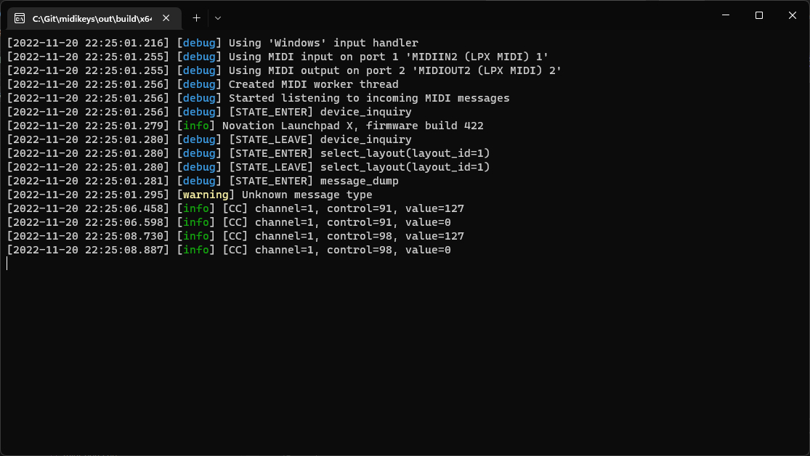

# midikeys

Utility that simulates keyboard input based on MIDI messages.



> ⚠ Currently only supports keyboard with a European QWERTY layout.

## Platforms

- Windows
- macOS (t.b.d)

## Supported Devices

| Manufacturer | Device      | Support |
| ------------ | ----------- | ------- |
| Novation     | Launchpad X | 🟢 Full |

> ℹ You can add support for any device using [device profiles](#device-profiles).

## Supported Applications

| Developer | Application | Support |
| --------- | ----------- | ------- |
| Pioneer   | rekordbox   | 🟢 Full |

> ℹ You can add support for any application using [mappings](#mappings).

## Usage

**Global Arguments**

| Argument    | Alias | Type    | Description             |
| ----------- | ----- | ------- | ----------------------- |
| `--verbose` | `-v`  | boolean | Enable extended logging |

### List MIDI Ports

```shell
midikeys --list
```

### Verify Configuration

```shell
midikeys --verify <mapping> <device_profile>
```

**Example**

```shell
midikeys --verify rekordbox novation-launchpad-x
```

### Run

```shell
midikeys --input=<port> --output=<port> <mapping> <device_profile>
```

**Example**

```shell
midikeys --input=0 --output=0 rekordbox novation-launchpad-x
```

## Mappings

Mappings are defined in `yaml` and allow you to dynamically bind MIDI events to key strokes.

```yaml
# Rekorbox
mapping:
  # CC Channel 1, Control 21-28
  - range:
      type: button
      midi:
        channel: 1
        control: [21, 28] # Create 8 buttons (21...28)
      keyboard: [q, w, e, r, t, y, u, i]
      color: green

  # CC Channel 1, Control 13
  - button:
      midi: [1, 13]
      keyboard: [arrow_left]
      color: orange

  # CC Channel 1, Control 14
  - button:
      midi: [1, 14]
      keyboard: [arrow_left]
      color: red
```

## Device Profiles

Devices profiles allow users to add support for a specific MIDI device.

```yaml
# Novation Launchpad X
profile:
  messages:
    # MIDI messages to send when connected
    open:
      - sysex: [240, 0, 32, 41, 2, 12, 14, 1, 247] # Select progammer layout
      - sysex: [240, 0, 32, 41, 2, 12, 8, 127, 247] # Max brightness
      - sysex: [240, 0, 32, 41, 2, 12, 4, 3, 127, 247] # Fixed velocity curve
    # MIDI messages to send before connection closes
    close:
      - sysex: [240, 0, 32, 41, 2, 12, 14, 0, 247] # Select live layout

  # Color to MIDI mapping
  # color_name: [on CC value, off CC value]
  colors:
    red: [7, 5]
    green: [23, 21]
    blue: [47, 45]
    cyan: [39, 37]
    magenta: [55, 53]
    yellow: [15, 13]
    orange: [10, 9]
    pink: [56, 57]
```

### Key Table (case-sensitive)

#### Internal

| Name        | Description          |
| ----------- | -------------------- |
| `bank_next` | Select next bank     |
| `bank_prev` | Select previous bank |
| `exit`      | Exit application     |

#### OS Specific

| Name    | Windows Key    | Apple Key          |
| ------- | -------------- | ------------------ |
| `super` | <kbd>Win</kbd> | <kbd>Command</kbd> |
| `menu`  | <kbd>Alt</kbd> | <kbd>Option</kbd>  |

#### Generic

| Name          | Key                |
| ------------- | ------------------ |
| `escape`      | <kbd>Escape</kbd>  |
| `shift`       | <kbd>Shift</kbd>   |
| `ctrl`        | <kbd>Control</kbd> |
| `f1`          | <kbd>F1</kbd>      |
| `f2`          | <kbd>F2</kbd>      |
| `f3`          | <kbd>F3</kbd>      |
| `f4`          | <kbd>F4</kbd>      |
| `f5`          | <kbd>F5</kbd>      |
| `f6`          | <kbd>F6</kbd>      |
| `f7`          | <kbd>F7</kbd>      |
| `f8`          | <kbd>F8</kbd>      |
| `f9`          | <kbd>F9</kbd>      |
| `f10`         | <kbd>F10</kbd>     |
| `f11`         | <kbd>F11</kbd>     |
| `f12`         | <kbd>F12</kbd>     |
| `arrow_left`  | <kbd>&larr;</kbd>  |
| `arrow_right` | <kbd>&rarr;</kbd>  |
| `arrow_up`    | <kbd>&uarr;</kbd>  |
| `arrow_down`  | <kbd>&darr;</kbd>  |
| `a`           | <kbd>A</kbd>       |
| `b`           | <kbd>B</kbd>       |
| `c`           | <kbd>C</kbd>       |
| `d`           | <kbd>D</kbd>       |
| `e`           | <kbd>E</kbd>       |
| `f`           | <kbd>F</kbd>       |
| `g`           | <kbd>G</kbd>       |
| `h`           | <kbd>H</kbd>       |
| `i`           | <kbd>I</kbd>       |
| `j`           | <kbd>J</kbd>       |
| `k`           | <kbd>K</kbd>       |
| `l`           | <kbd>L</kbd>       |
| `m`           | <kbd>M</kbd>       |
| `n`           | <kbd>N</kbd>       |
| `o`           | <kbd>O</kbd>       |
| `p`           | <kbd>P</kbd>       |
| `q`           | <kbd>Q</kbd>       |
| `r`           | <kbd>R</kbd>       |
| `s`           | <kbd>S</kbd>       |
| `t`           | <kbd>T</kbd>       |
| `u`           | <kbd>U</kbd>       |
| `v`           | <kbd>V</kbd>       |
| `w`           | <kbd>W</kbd>       |
| `x`           | <kbd>X</kbd>       |
| `y`           | <kbd>Y</kbd>       |
| `z`           | <kbd>Z</kbd>       |
| `0`           | <kbd>0</kbd>       |
| `1`           | <kbd>1</kbd>       |
| `2`           | <kbd>2</kbd>       |
| `3`           | <kbd>3</kbd>       |
| `4`           | <kbd>4</kbd>       |
| `5`           | <kbd>5</kbd>       |
| `6`           | <kbd>6</kbd>       |
| `7`           | <kbd>7</kbd>       |
| `8`           | <kbd>8</kbd>       |
| `9`           | <kbd>9</kbd>       |
